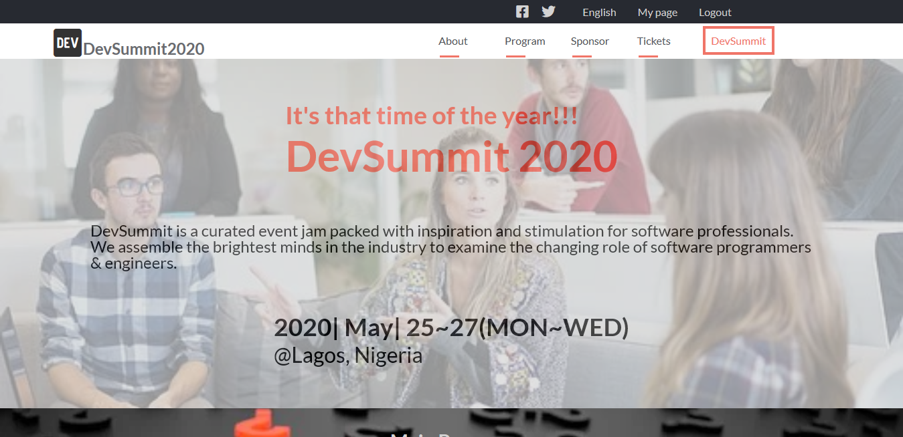

# Devsummit

Capstone Project [Microverse]
HTML & CSS Capstone Project it's an online Developer website called 
DevSummit (2020) it's a curated event jam packed with inspiration and stimulation for software professionals.
Brightest minds in the industry assemble every year to examine the changing roles of software programmers, engineers, developers, managers and architects in order to explore crucial technologies, cutting-edge techniques, and provide essential professional training.


 
## Built With

- HTML5
- CSS3
      [Flex]
      [Grid]
- JavaScript
[LIVE DEMO LINK](https://haroonabdulrazaq.github.io/Devsummit/)

## Work Done 🔧

- Use semantic HTML tags.
- Use CSS selectors correctly.
- Use HTML elements box model (margin, padding, width, height).
- Use industry-standard tools (flexbox) to place elements in the page.
- Ability to create UIs adaptable to different screen sizes using mediaqueries.
- Apply front-end best practices.
- Ability to create UIs adjusted to given designs.
- Strong English written and verbal communication.
- Ability to communicate information effectively to technical and non-technical people.
- Ability to translate business requirements into software solutions.
- Ability to work well in a fast-paced environment under deadlines.
- Ability to perform tasks and complete projects with minimal supervision.


# Getting Started 🚀

These instructions will get you a copy of the project up and running on your local machine.

## How To Use 🔧

From your command line, first clone the project:  

```bash
# Clone this repository
$ git clone https://github.com/Haroonabdulrazaq/Devsummit.git

# Go into the repository
$ cd Devsummit

```

## Author

👤 **Haroon Abdulrazaq**

- Github: [@githubhandle](https://github.com/Haroonabdulrazaq)
- Twitter: [@twitterhandle](https://twitter.com/hanq_o)
- Linkedin: [linkedin](https://www.linkedin.com/in/haroon-abdulrazaq-817906100/)

## Show your support

Give a ⭐️ if you like this project!

## Acknowledgments

- I acknowledge Microverse, the global remote school for developers.
- I appreciate The Odin Project for providing the project and making lessons simple to learn.
- I appreciate Cindy Shin for providing me with the design

## 📝 License

This project is [MIT](lic.url) licensed.
